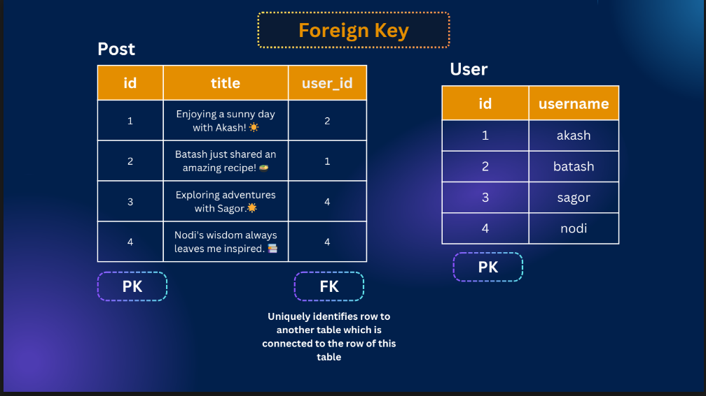
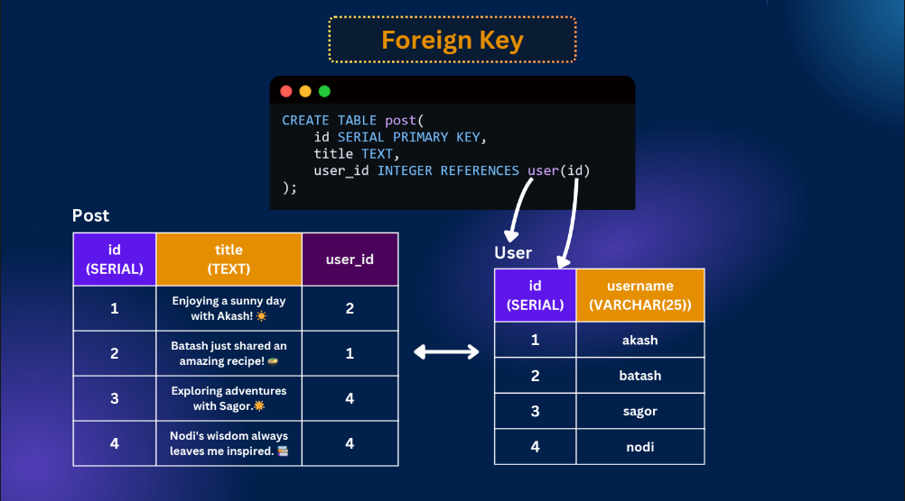
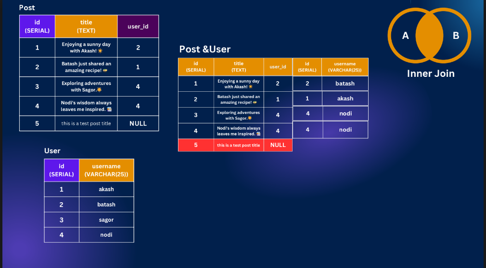
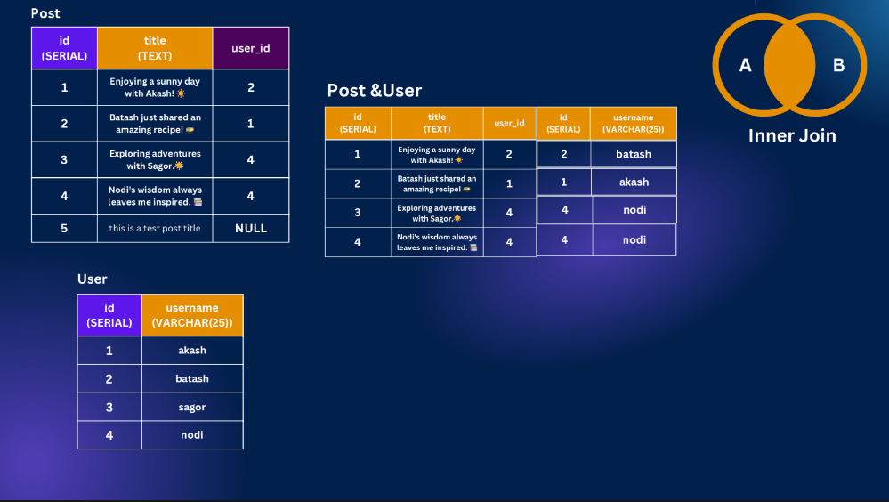
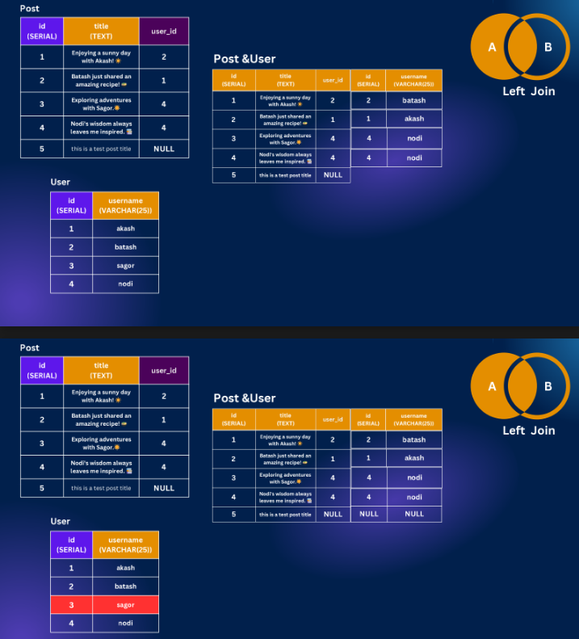
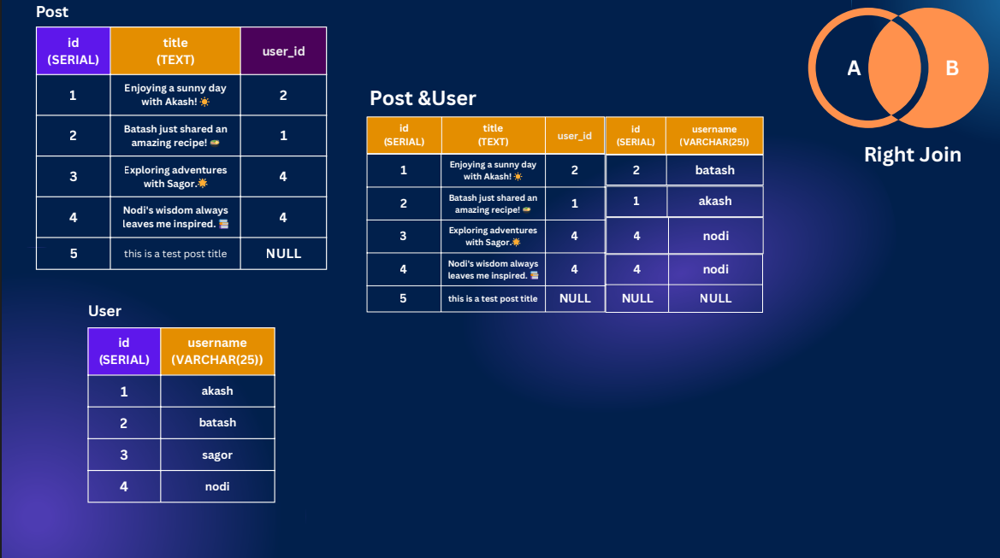
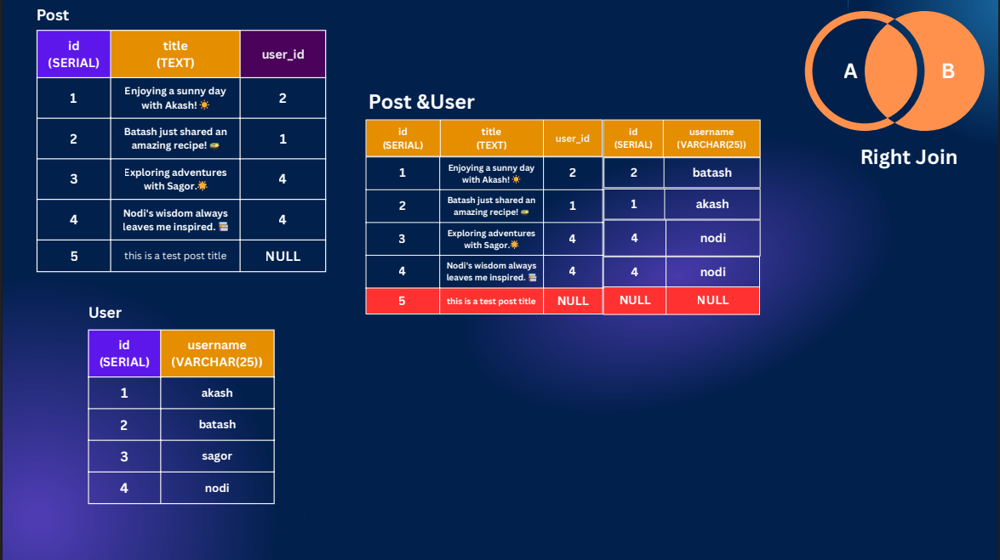
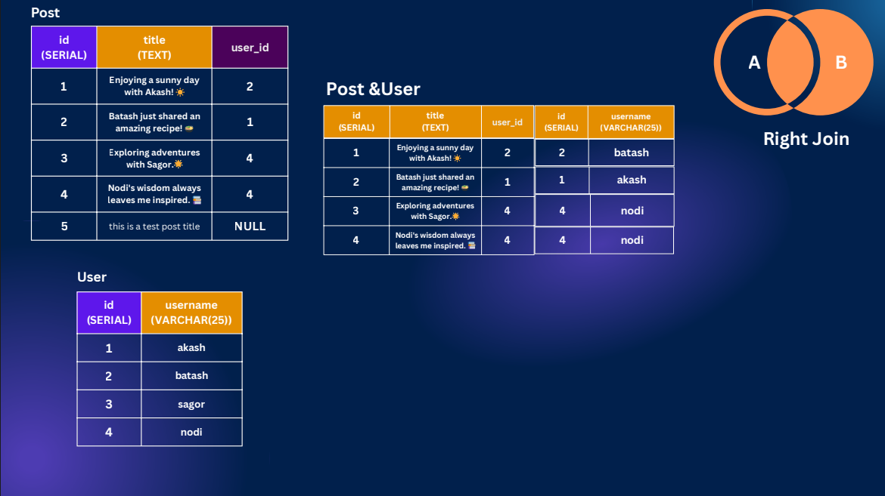
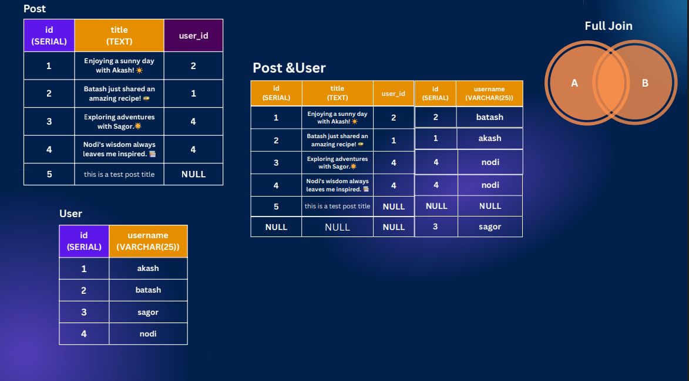

# PostgreSQL-Keys-Join-and-Date-Relationships

Slide Link: https://drive.google.com/file/d/1CpfSPU_WYHSXEg_Yc3H02PZQ9Hsf9kny/view?usp=drive_link


This module dives into the fundamentals of relational database connections using foreign keys and constraints. You’ll learn how to work with different types of SQL joins—Inner, Left, Right, Full, Cross, and Natural—to combine data effectively across tables. To strengthen your skills, we’ve included hands-on SQL practice sessions so you can apply what you’ve learned in real scenarios.


## 47-1 Foreign Key Explained
- Foreign key is one tables primary key is set in another table and makes a relationship 





## 47-2 Adding Foreign Key Constraint

- create user table 

```sql 
CREATE TABLE
  users (
    id serial PRIMARY KEY,
    username VARCHAR(25) NOT NULL
  );
```

- create post table 

```sql
CREATE TABLE
  post (
    id serial PRIMARY KEY,
    title TEXT NOT NULL,
    user_id INTEGER REFERENCES users (id) NOT Null
  );
```

## 47-3 Understanding Inner Join
- merging the table

```sql
select * from post
 join users on users.id = post.user_id;
```

- ambiguous error of same id

```sql 
select id,title,username from post
 join users on users.id = post.user_id;
```

- to avoid this error we have to pass context 

```sql 
select post.id,title,username from post
 join users on users.id = post.user_id;
```

```sql 
select p.id, title,username from post as p
 join users as u on  p.user_id = u.id;
```

- this join ais called inner join as well 

```sql 
select p.id, title,username from post as p
inner join users as u on  p.user_id = u.id;
```





## 47-4 Left Join Made Easy

```sql 
INSERT INTO post (title)
VALUES('Chazid Post');

select * from post as p
left join users as u on  p.user_id = u.id;
```
```sql 
select * from post as p
left outer join users as u on  p.user_id = u.id;
```



## 47-5 Right & Full Join

```sql 
INSERT INTO users (username)
  VALUES('malis');

select * from post as p
right join users as u on  p.user_id = u.id;
```
```sql 
select * from post as p
right outer join users as u on  p.user_id = u.id;
```








#### Full join 



```sql 
select * from post as p
full join users as u on  p.user_id = u.id;
```

```sql 
select * from post as p
full outer join users as u on  p.user_id = u.id;
```