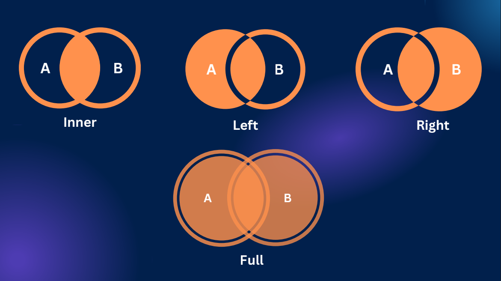
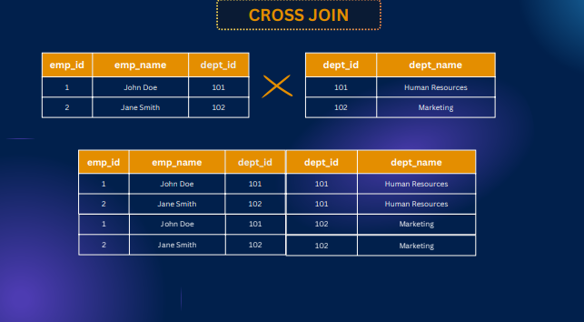

# PostgreSQL-Keys-Join-and-Date-Relationships

Slide Link: https://drive.google.com/file/d/1CpfSPU_WYHSXEg_Yc3H02PZQ9Hsf9kny/view?usp=drive_link


This module dives into the fundamentals of relational database connections using foreign keys and constraints. You’ll learn how to work with different types of SQL joins—Inner, Left, Right, Full, Cross, and Natural—to combine data effectively across tables. To strengthen your skills, we’ve included hands-on SQL practice sessions so you can apply what you’ve learned in real scenarios.


## 47-1 Foreign Key Explained
- Foreign key is one tables primary key is set in another table and makes a relationship 


## 47-2 Adding Foreign Key Constraint

- create user table 

```sql 
CREATE TABLE
  users (
    id serial PRIMARY KEY,
    username VARCHAR(25) NOT NULL
  );
```

- create post table 

```sql
CREATE TABLE
  post (
    id serial PRIMARY KEY,
    title TEXT NOT NULL,
    user_id INTEGER REFERENCES users (id) NOT Null
  );
```

## 47-3 Understanding Inner Join
- merging the table

```sql
select * from post
 join users on users.id = post.user_id;
```

- ambiguous error of same id

```sql 
select id,title,username from post
 join users on users.id = post.user_id;
```

- to avoid this error we have to pass context 

```sql 
select post.id,title,username from post
 join users on users.id = post.user_id;
```

```sql 
select p.id, title,username from post as p
 join users as u on  p.user_id = u.id;
```

- this join ais called inner join as well 

```sql 
select p.id, title,username from post as p
inner join users as u on  p.user_id = u.id;
```


## 47-4 Left Join Made Easy

```sql 
INSERT INTO post (title)
VALUES('Chazid Post');

select * from post as p
left join users as u on  p.user_id = u.id;
```
```sql 
select * from post as p
left outer join users as u on  p.user_id = u.id;
```


## 47-5 Right & Full Join

```sql 
INSERT INTO users (username)
  VALUES('malis');

select * from post as p
right join users as u on  p.user_id = u.id;
```
```sql 
select * from post as p
right outer join users as u on  p.user_id = u.id;
```


#### Full join 


```sql 
select * from post as p
full join users as u on  p.user_id = u.id;
```

```sql 
select * from post as p
full outer join users as u on  p.user_id = u.id;
```

## 47-6 All Joins Overview (Cross & Natural too)



### cross join 

```sql 
CREATE TABLE employees(
    emp_id SERIAL PRIMARY KEY,
    emp_name VARCHAR(50),
    dept_id INT
)

CREATE TABLE departments (
    dept_id SERIAL PRIMARY KEY,
    dept_name VARCHAR(50)
);

INSERT INTO employees VALUES(1,'John Doe', 101);
INSERT INTO employees VALUES(2,'Jane Smith', 102);

INSERT INTO departments VALUES( 102,'Marketing');
INSERT INTO departments VALUES( 101,'Human Resources');

select * from employees 
cross join departments;
```



### natural join 

```sql 
select * from employees 
natural join departments;
```


## SQL practice - 1, 47-8 SQL Practice –  2, 47-9 SQL Practice –  3

```sql 
CREATE TABLE employees(
    employee_id SERIAL PRIMARY KEY,
    employee_name VARCHAR(50),
    department_id INTEGER REFERENCES departments(department_id),
    salary DECIMAL(10,2),
    hire_date DATE
)

CREATE TABLE departments (
    department_id SERIAL PRIMARY KEY,
    department_name VARCHAR(50)
);

INSERT INTO departments (department_name) VALUES
    ('HR'),
    ('Marketing'),
    ('Finance'),
    ('IT'),
    ('Sales'),
    ('Engineering'),
    ('Customer Support'),
    ('Administration'),
    ('Research'),
    ('Quality Assurance');


INSERT INTO employees (employee_name, department_id, salary, hire_date) VALUES
    ('John Doe', 1, 60000.00, '2022-01-10'),
    ('Jane Smith', 2, 75000.50, '2021-05-22'),
    ('Bob Johnson', 3, 80000.75, '2020-11-15'),
    ('Alice Williams', 4, 90000.25, '2019-08-03'),
    ('David Lee', 5, 65000.50, '2020-03-18'),
    ('Sara Brown', 6, 70000.00, '2021-09-28'),
    ('Mike Miller', 7, 55000.75, '2022-02-05'),
    ('Emily Davis', 8, 95000.00, '2018-12-12'),
    ('Chris Wilson', 9, 72000.50, '2020-06-30'),
    ('Amy White', 10, 68000.25, '2021-11-09'),
    ('John Johnson', 1, 62000.00, '2022-01-15'),
    ('Jessica Thompson', 2, 78000.50, '2021-06-05'),
    ('Michael Harris', 3, 85000.75, '2020-11-25'),
    ('Emma Martinez', 4, 92000.25, '2019-09-15'),
    ('James Taylor', 5, 67000.50, '2020-04-08'),
    ('Sophia Anderson', 6, 72000.00, '2021-10-10'),
    ('William Jackson', 7, 56000.75, '2022-02-10'),
    ('Olivia Nelson', 8, 97000.00, '2018-12-20'),
    ('Daniel White', 9, 73000.50, '2020-07-05'),
    ('Ava Wilson', 10, 69000.25, '2021-11-15'),
    ('Matthew Brown', 1, 63000.00, '2022-01-20'),
    ('Emily Garcia', 2, 76000.50, '2021-06-15'),
    ('Christopher Allen', 3, 86000.75, '2020-12-05'),
    ('Madison Hall', 4, 93000.25, '2019-09-25'),
    ('Andrew Cook', 5, 68000.50, '2020-04-18'),
    ('Abigail Torres', 6, 73000.00, '2021-10-20'),
    ('Ethan Murphy', 7, 57000.75, '2022-02-15'),
    ('Ella King', 8, 98000.00, '2018-12-28'),
    ('Nathan Rivera', 9, 74000.50, '2020-07-15'),
    ('Mia Roberts', 10, 70000.25, '2021-11-20');

select * from employees
inner join departments using(department_id);

select round(avg(salary)) as avg_salary, department_name from employees
inner join departments using(department_id)
group by department_name;

select department_name, count(*) as total_employee, round(avg(salary)) as avg_salary from employees
inner join departments using(department_id)
group by department_name
  order by avg_salary ASC limit 1;

select department_name, count(*) as total_employees, round(avg(salary)) as avg_salary from employees
inner join departments using(department_id)
group by department_name
  order by avg_salary DESC limit 1;

select extract(year from hire_date) as hire_year, count(*) as employee_hired from employees
  group by hire_year;
```