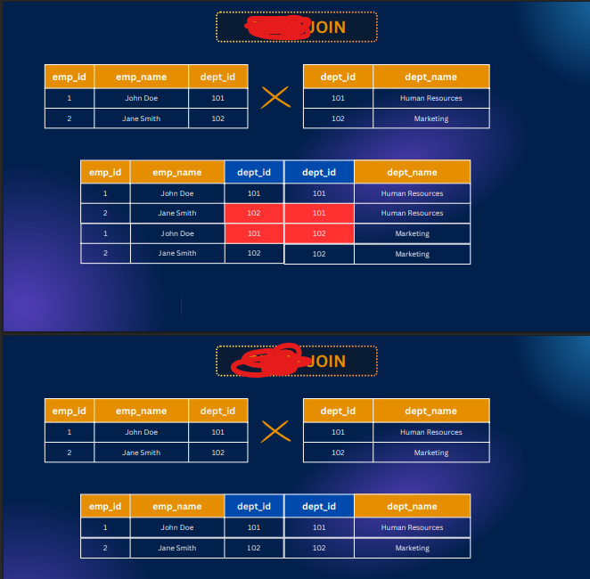

# PostgreSQL-Keys-Join-and-Date-Relationships

Slide Link: https://drive.google.com/file/d/1CpfSPU_WYHSXEg_Yc3H02PZQ9Hsf9kny/view?usp=drive_link


This module dives into the fundamentals of relational database connections using foreign keys and constraints. You’ll learn how to work with different types of SQL joins—Inner, Left, Right, Full, Cross, and Natural—to combine data effectively across tables. To strengthen your skills, we’ve included hands-on SQL practice sessions so you can apply what you’ve learned in real scenarios.


## 47-1 Foreign Key Explained
- Foreign key is one tables primary key is set in another table and makes a relationship 


## 47-2 Adding Foreign Key Constraint

- create user table 

```sql 
CREATE TABLE
  users (
    id serial PRIMARY KEY,
    username VARCHAR(25) NOT NULL
  );
```

- create post table 

```sql
CREATE TABLE
  post (
    id serial PRIMARY KEY,
    title TEXT NOT NULL,
    user_id INTEGER REFERENCES users (id) NOT Null
  );
```

## 47-3 Understanding Inner Join
- merging the table

```sql
select * from post
 join users on users.id = post.user_id;
```

- ambiguous error of same id

```sql 
select id,title,username from post
 join users on users.id = post.user_id;
```

- to avoid this error we have to pass context 

```sql 
select post.id,title,username from post
 join users on users.id = post.user_id;
```

```sql 
select p.id, title,username from post as p
 join users as u on  p.user_id = u.id;
```

- this join ais called inner join as well 

```sql 
select p.id, title,username from post as p
inner join users as u on  p.user_id = u.id;
```


## 47-4 Left Join Made Easy

```sql 
INSERT INTO post (title)
VALUES('Chazid Post');

select * from post as p
left join users as u on  p.user_id = u.id;
```
```sql 
select * from post as p
left outer join users as u on  p.user_id = u.id;
```


## 47-5 Right & Full Join

```sql 
INSERT INTO users (username)
  VALUES('malis');

select * from post as p
right join users as u on  p.user_id = u.id;
```
```sql 
select * from post as p
right outer join users as u on  p.user_id = u.id;
```


#### Full join 


```sql 
select * from post as p
full join users as u on  p.user_id = u.id;
```

```sql 
select * from post as p
full outer join users as u on  p.user_id = u.id;
```

## 47-6 All Joins Overview (Cross & Natural too)


### cross join 

```sql 
CREATE TABLE employees(
    emp_id SERIAL PRIMARY KEY,
    emp_name VARCHAR(50),
    dept_id INT
)

CREATE TABLE departments (
    dept_id SERIAL PRIMARY KEY,
    dept_name VARCHAR(50)
);

INSERT INTO employees VALUES(1,'John Doe', 101);
INSERT INTO employees VALUES(2,'Jane Smith', 102);

INSERT INTO departments VALUES( 102,'Marketing');
INSERT INTO departments VALUES( 101,'Human Resources');

select * from employees 
cross join departments;
```


### natural join 

```sql 
select * from employees 
natural join departments;
```



## SQL practice - 1, 47-8 SQL Practice –  2, 47-9 SQL Practice –  3

```sql 
CREATE TABLE employees(
    employee_id SERIAL PRIMARY KEY,
    employee_name VARCHAR(50),
    department_id INTEGER REFERENCES departments(department_id),
    salary DECIMAL(10,2),
    hire_date DATE
)

CREATE TABLE departments (
    department_id SERIAL PRIMARY KEY,
    department_name VARCHAR(50)
);

INSERT INTO departments (department_name) VALUES
    ('HR'),
    ('Marketing'),
    ('Finance'),
    ('IT'),
    ('Sales'),
    ('Engineering'),
    ('Customer Support'),
    ('Administration'),
    ('Research'),
    ('Quality Assurance');


INSERT INTO employees (employee_name, department_id, salary, hire_date) VALUES
    ('John Doe', 1, 60000.00, '2022-01-10'),
    ('Jane Smith', 2, 75000.50, '2021-05-22'),
    ('Bob Johnson', 3, 80000.75, '2020-11-15'),
    ('Alice Williams', 4, 90000.25, '2019-08-03'),
    ('David Lee', 5, 65000.50, '2020-03-18'),
    ('Sara Brown', 6, 70000.00, '2021-09-28'),
    ('Mike Miller', 7, 55000.75, '2022-02-05'),
    ('Emily Davis', 8, 95000.00, '2018-12-12'),
    ('Chris Wilson', 9, 72000.50, '2020-06-30'),
    ('Amy White', 10, 68000.25, '2021-11-09'),
    ('John Johnson', 1, 62000.00, '2022-01-15'),
    ('Jessica Thompson', 2, 78000.50, '2021-06-05'),
    ('Michael Harris', 3, 85000.75, '2020-11-25'),
    ('Emma Martinez', 4, 92000.25, '2019-09-15'),
    ('James Taylor', 5, 67000.50, '2020-04-08'),
    ('Sophia Anderson', 6, 72000.00, '2021-10-10'),
    ('William Jackson', 7, 56000.75, '2022-02-10'),
    ('Olivia Nelson', 8, 97000.00, '2018-12-20'),
    ('Daniel White', 9, 73000.50, '2020-07-05'),
    ('Ava Wilson', 10, 69000.25, '2021-11-15'),
    ('Matthew Brown', 1, 63000.00, '2022-01-20'),
    ('Emily Garcia', 2, 76000.50, '2021-06-15'),
    ('Christopher Allen', 3, 86000.75, '2020-12-05'),
    ('Madison Hall', 4, 93000.25, '2019-09-25'),
    ('Andrew Cook', 5, 68000.50, '2020-04-18'),
    ('Abigail Torres', 6, 73000.00, '2021-10-20'),
    ('Ethan Murphy', 7, 57000.75, '2022-02-15'),
    ('Ella King', 8, 98000.00, '2018-12-28'),
    ('Nathan Rivera', 9, 74000.50, '2020-07-15'),
    ('Mia Roberts', 10, 70000.25, '2021-11-20');

select * from employees
inner join departments using(department_id);

select round(avg(salary)) as avg_salary, department_name from employees
inner join departments using(department_id)
group by department_name;

select department_name, count(*) as total_employee, round(avg(salary)) as avg_salary from employees
inner join departments using(department_id)
group by department_name
  order by avg_salary ASC limit 1;

select department_name, count(*) as total_employees, round(avg(salary)) as avg_salary from employees
inner join departments using(department_id)
group by department_name
  order by avg_salary DESC limit 1;

select extract(year from hire_date) as hire_year, count(*) as employee_hired from employees
  group by hire_year;
```

## 47-10 Subquery Basics
- SUBQUERIES : A subquery is a nested query within another sql statement 
- and under which the subquery is written is called Primary Query/ Main Query

- Retrieve all employees whose salary is greater than the highest of the hr department.
#### here two things are required :
- first find the hr department highest salary
- compare the Hr department highest salary with all employee salary


```sql 
CREATE TABLE employees (
    employee_id SERIAL PRIMARY KEY,
    employee_name VARCHAR(50) NOT NULL,
    department_name VARCHAR(50),
    salary DECIMAL(10, 2),
    hire_date DATE
);


INSERT INTO employees (employee_name, department_name, salary, hire_date) VALUES 
    ('John Doe', 'HR', 60000.00, '2022-01-10'),
    ('Jane Smith', 'Marketing', 75000.50, '2021-05-22'),
    ('Bob Johnson', 'Finance', 80000.75, '2020-11-15'),
    ('Alice Williams', 'IT', 90000.25, '2019-08-03'),
    ('David Lee', 'Sales', 65000.50, '2020-03-18'),
    ('Sara Brown', 'Engineering', 70000.00, '2021-09-28'),
    ('Mike Miller', 'Customer Support', 55000.75, '2022-02-05'),
    ('Emily Davis', 'Administration', 95000.00, '2018-12-12'),
    ('Chris Wilson', 'Research', 72000.50, '2020-06-30'),
    ('Amy White', 'Quality Assurance', 68000.25, '2021-11-09'),
    ('John Johnson', 'HR', 62000.00, '2022-01-15'),
    ('Jessica Thompson', 'Marketing', 78000.50, '2021-06-05'),
    ('Michael Harris', 'Finance', 85000.75, '2020-11-25'),
    ('Emma Martinez', 'IT', 92000.25, '2019-09-15'),
    ('James Taylor', 'Sales', 67000.50, '2020-04-08'),
    ('Sophia Anderson', 'Engineering', 72000.00, '2021-10-10'),
    ('William Jackson', 'Customer Support', 56000.75, '2022-02-10'),
    ('Olivia Nelson', 'Administration', 97000.00, '2018-12-20'),
    ('Daniel White', 'Research', 73000.50, '2020-07-05'),
    ('Ava Wilson', 'Quality Assurance', 69000.25, '2021-11-15'),
    ('Matthew Brown', 'HR', 63000.00, '2022-01-20'),
    ('Emily Garcia', 'Marketing', 76000.50, '2021-06-15'),
    ('Christopher Allen', 'Finance', 86000.75, '2020-12-05'),
    ('Madison Hall', 'IT', 93000.25, '2019-09-25'),
    ('Andrew Cook', 'Sales', 68000.50, '2020-04-18'),
    ('Abigail Torres', 'Engineering', 73000.00, '2021-10-20'),
    ('Ethan Murphy', 'Customer Support', 57000.75, '2022-02-15'),
    ('Ella King', 'Administration', 98000.00, '2018-12-28'),
    ('Nathan Rivera', 'Research', 74000.50, '2020-07-15'),
    ('Mia Roberts', 'Quality Assurance', 70000.25, '2021-11-20');


SELECT * from employees;

SELECT max(salary) from employees where department_name ='HR';

SELECT * FROM employees WHERE salary > 63000;

select * from employees where salary > (select max(salary) from employees where department_name='HR');

-- suppose we want to see the employees table and we want to see the sum of the employee salaries beside each of the employee

select *, (select sum(salary) from employees) from employees;

SELECT department_name, sum(salary) FROM employees
GROUP BY department_name;

SELECT * FROM(SELECT department_name, sum(salary) FROM employees GROUP BY department_name) as sum_dept_salary;
SELECT department_name FROM(SELECT department_name, sum(salary) FROM employees GROUP BY department_name) as sum_dept_salary;

SELECT * FROM employees WHERE salary > (SELECT  max(salary) from employees where department_name = 'HR');

SELECT employee_name, salary, department_name FROM employees
WHERE department_name IN (SELECT department_name from employees where department_name LIKE '%R%')


-- this will show error
SELECT employee_name, salary, department_name FROM employees
WHERE department_name, salary IN (SELECT department_name from employees where department_name LIKE '%R%');

```

## function, procedure, indexing, trigger
- views 
```sql 
CREATE VIEW dept_avg_salary -- view name
AS --as clause
SELECT department_name, avg(salary) FROM employees GROUP BY department_name; --query whose reference will be stored in view.

SELECT * FROM dept_avg_salary;

CREATE VIEW test_view AS
SELECT employee_name, salary, department_name
FROM employees
WHERE department_name IN (
    SELECT department_name
    FROM employees
    WHERE department_name LIKE '%R%'
);

SELECT * FROM test_view;
```
- non procedural function 

```sql 
SELECT count(*) FROM employees

CREATE Function emp_count()
RETURNS INT
LANGUAGE sql -- here can be plpgsql/plperl/PL/Python or etc for PROCEDURAL
AS
$$
-- here will be the function body
SELECT count(*) FROM employees
$$

SELECT emp_count();
```

```sql 
CREATE or REPLACE function delete_emp()
RETURNS void
LANGUAGE SQL
AS
$$
DELETE FROM employees WHERE employee_id = 30;
$$

SELECT delete_emp();

```

```sql 
CREATE OR replace FUNCTION delete_emp_by_id(p_emp_id INT)
RETURNS void
LANGUAGE SQL
AS
$$
DELETE FROM employees WHERE employee_id = p_emp_id;
$$

SELECT delete_emp_by_id(29);
```

- procedures 

```sql 
CREATE PROCEDURE remove_emp()
LANGUAGE plpgsql
AS
$$
BEGIN
-- here we can write multiple sql queries or one single queries
-- here will exist the works/action that we want to do using procedure.
DELETE FROM employees WHERE employee_id = 28;
END
$$

CALL remove_emp()
```

```sql 
CREATE PROCEDURE remove_emp_var()
LANGUAGE plpgsql
AS
$$
DECLARE
test_var INT;
BEGIN
SELECT employee_id INTO test_var FROM employees WHERE employee_id = 26;
DELETE FROM employees WHERE employee_id = test_var;
END
$$

CALL remove_emp_var()

SELECT * FROM employees
```

```sql 
CREATE PROCEDURE remove_emp_by_p(p_employee_id int)
LANGUAGE plpgsql
AS
$$

DECLARE
test_var INT;
-- variable declared.

BEGIN
SELECT employee_id INTO test_var FROM employees WHERE employee_id = p_employee_id;
 -- we are setting the id to the variable test_var and then we are doing the operation
DELETE FROM employees WHERE employee_id = test_var;

RAISE NOTICE 'Employee Removed Successfully';
-- this will give a notice if deleted.
END

$$;

CALL remove_emp_by_p(27)

SELECT * FROM employees
```
- triggers

```sql
CREATE Table my_users
(
    user_name VARCHAR(50),
    email VARCHAR(100)
);

INSERT INTO my_users VALUES('Mezba', 'mezba@mail.com'), ('Mir', 'mir@mail.com');

SELECT * from my_users;

SELECT * from deleted_users_audit;

CREATE  Table deleted_users_audit
(
    deleted_user_name VARCHAR(50),
    deletedAt TIMESTAMP
)


DROP TABLE deleted_users_audit

DROP TABLE my_users

-- lets create a trigger

CREATE OR replace function save_deleted_user()
RETURNS TRIGGER
LANGUAGE plpgsql
AS
$$
BEGIN

INSERT INTO deleted_users_audit values(OLD.user_name, now());
-- we are using OLD here since we are getting after delete here and the data became old.
-- here OLD.user_name means what will delete whose row's user name will get here using this.
-- If it was a before functionality we will get the data in new.user_name
-- we are getting new and old since `each row`  is mentioned. If its mentioned that `EACH STATEMENT` we wont get the new or old
RAISE NOTICE'Deleted User Log Created!';
RETURN OLD;

END
$$

CREATE OR replace Trigger save_deleted_user_trigger
BEFORE DELETE
on my_users -- The table from the user will be deleted
FOR EACH ROW --So if you run a DELETE statement that deletes 5 rows, your trigger function (save_deleted_user()) will be called 5 times, once per row.
--we are getting new and old since `each row`  is mentioned. If its mentioned that `EACH STATEMENT` we wont get the new or old
EXECUTE function save_deleted_user();
-- if we use mysql we can  create a function statement directly but in postgres we can not, in postgres we have to give  a function reference her which makes it more readable.

DELETE from my_users WHERE user_name = 'Mir';
```
- indexing 

```sql 

CREATE TABLE employees (
    employee_no SERIAL PRIMARY KEY,
    birth_date DATE NOT NULL,
    first_name VARCHAR(14) NOT NULL,
    last_name VARCHAR(16) NOT NULL,
    gender CHAR(1) CHECK (gender IN ('M', 'F')),
    hire_date DATE NOT NULL
);

INSERT INTO employees (birth_date, first_name, last_name, gender, hire_date)
VALUES
-- Original entries
('1993-01-02', 'Sarah', 'Chang', 'F', '2016-01-27'),
('1991-12-10', 'Deanna', 'Dixon', 'F', '2020-07-17'),
('1979-04-02', 'Walter', 'Howard', 'M', '2023-12-21'),
('1970-11-03', 'Brenda', 'Taylor', 'F', '2019-08-24'),
('2005-05-06', 'Victoria', 'Patel', 'F', '2017-11-19'),
('1985-07-14', 'James', 'Smith', 'M', '2015-03-01'),
('1990-09-21', 'Emily', 'Johnson', 'F', '2018-06-12'),
('1982-02-10', 'Robert', 'Williams', 'M', '2014-11-30'),
('1995-03-25', 'Linda', 'Brown', 'F', '2021-02-18'),
('1988-06-17', 'Michael', 'Jones', 'M', '2017-09-07'),
('1996-12-05', 'Jennifer', 'Garcia', 'F', '2022-10-25'),
('1975-08-29', 'William', 'Miller', 'M', '2013-05-14'),
('1983-11-19', 'Elizabeth', 'Davis', 'F', '2016-08-30'),
('1992-04-04', 'David', 'Rodriguez', 'M', '2019-01-10'),
('1987-01-08', 'Susan', 'Martinez', 'F', '2020-04-04'),
('1999-10-12', 'Daniel', 'Hernandez', 'M', '2021-12-15'),
('2001-06-30', 'Jessica', 'Lopez', 'F', '2023-03-22'),
('1973-09-16', 'Charles', 'Gonzalez', 'M', '2012-10-01'),
('1989-05-20', 'Karen', 'Wilson', 'F', '2015-07-09'),
('1994-02-28', 'Matthew', 'Anderson', 'M', '2018-01-27'),
('2000-11-11', 'Ashley', 'Thomas', 'F', '2022-06-04'),
('1997-03-07', 'Joseph', 'Moore', 'M', '2020-08-19'),
('1981-12-24', 'Amanda', 'Taylor', 'F', '2017-11-11'),
('1978-04-15', 'Andrew', 'Jackson', 'M', '2013-02-23');


TRUNCATE Table employees

SELECT * FROM employees;

EXPLAIN ANALYSE -- this will how the query is executed and show how much time is taken.
SELECT * from employees WHERE last_name = 'Moore';
```

```sql 
EXPLAIN ANALYSE -- this will how the query is executed and show how much time is taken.
SELECT * from employees WHERE last_name = 'Moore';

CREATE INDEX idx_employees_last_name
ON employees (last_name);
```